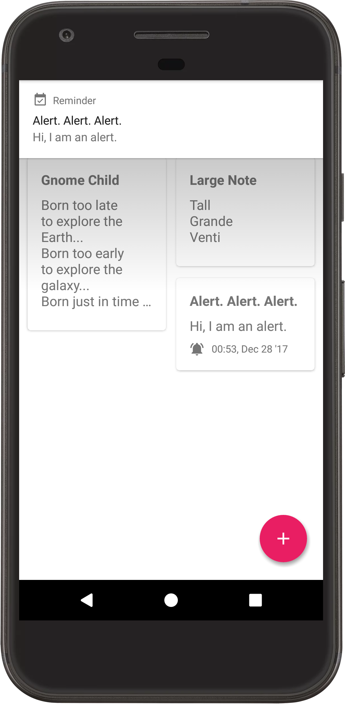
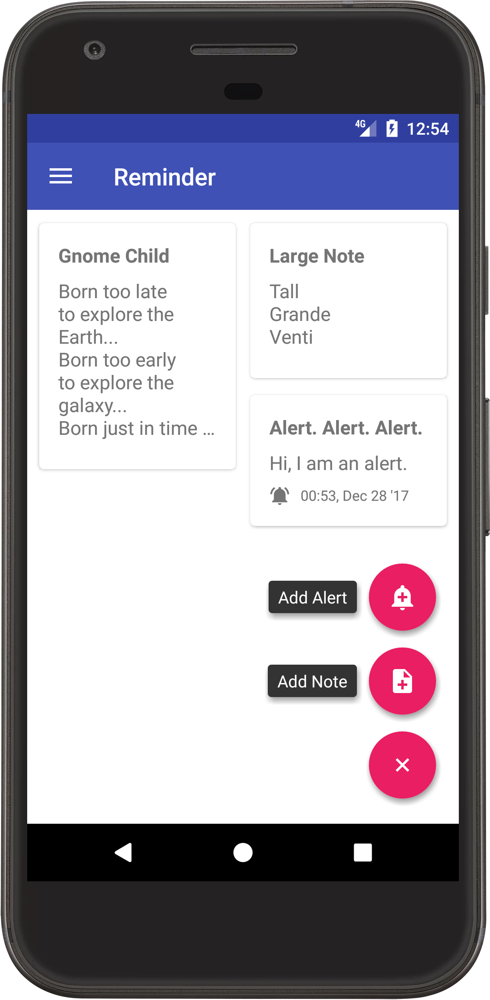

# Reminder
  
A simple Android material design reminder app.

# Features
Allows you to add notes, remove notes, add alerts and remove alerts.  
Repeated alert intervals.  
Notification alerts.  
 

# Changelog
~~No save feature as of yet. Will get to it when I have the time.~~

Save feature has been added.

~~Alerts partially implemented. You can set date and time of the alert, as well as a note accompanying the alert.~~

~~However, alarm has not been implemented to alert as of yet.~~

Alert feature, with working alarm notification has been implemented.

Navigation Drawer added that categorizes items.

Made dialog colours more consistent with theme.

# TO-DO
Improve the UI  
General QOL changes

# Acknowledgements
[FloatingActionButton](https://github.com/Clans/FloatingActionButton) by Clans.  
[RecyclerView-MultiSelect](https://github.com/bignerdranch/recyclerview-multiselect) by Big Nerd Ranch.

